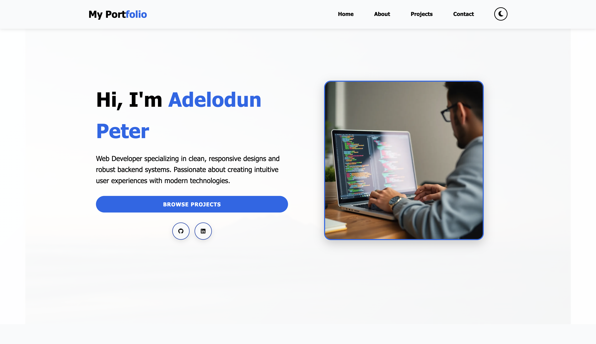
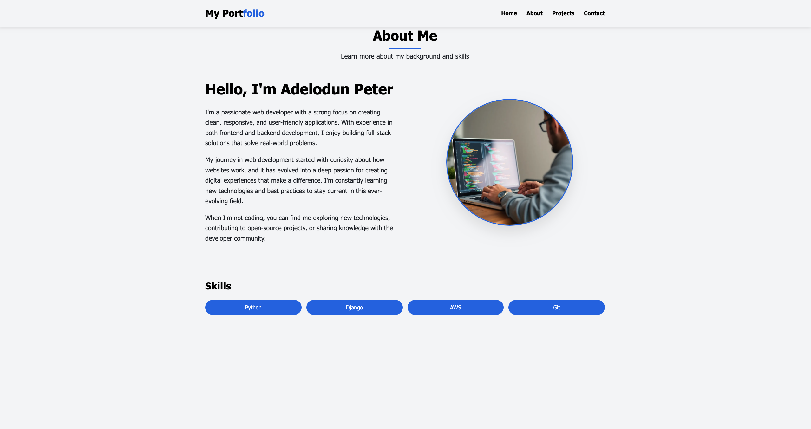
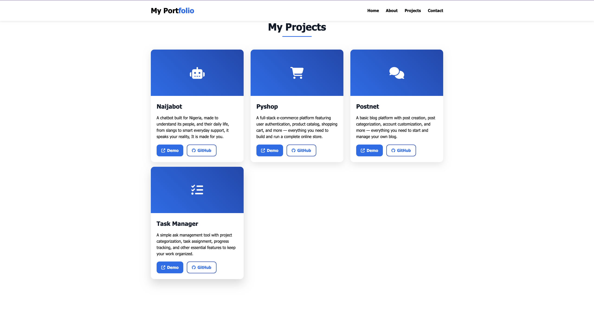
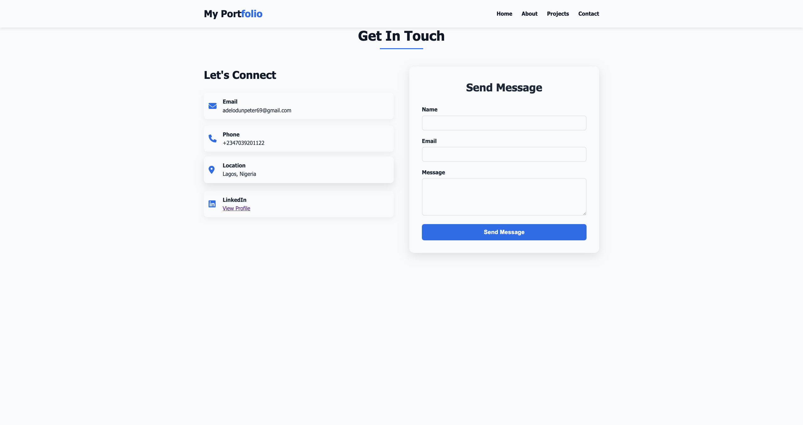

# Webmine Portfolio

## Table of Contents

* About the Project
* Tech Stack
* Features
* Demo
* Screenshots
* Installation
* Usage
* Deployment
* Contact
* License


---

## About the Project

Welcome to my personal portfolio. This site showcases my skills, projects, and experience as a web developer. It is designed to be clean, responsive, and user-friendly, providing visitors with an immersive overview of my work.

Key objectives:

* Highlight my technical expertise and projects.
* Offer a clear and intuitive navigation experience.
* Provide contact avenues for potential clients or collaborators.

---

## Tech Stack

This portfolio leverages modern web technologies:

* HTML for semantic structure.
* CSS for responsive layout and design.
* JavaScript for interactivity.
* Python & Django for backend integration

---

## Features

* Responsive Design: Optimized for mobile, tablet, and desktop.
* Dynamic Blog Section: Powered by Django, allowing easy post management.
* Contact Form: Secure form with validation and email notifications.
* Project Showcase: Detailed project cards with descriptions and links.

A live demo of the portfolio is available at

[https://portfolio-14b1.onrender.com]

---
Screenshots

Add screenshots of your project below. For example:

Homepage



About Section



Projects Section



Contact Section



## Installation

Follow these steps to run the portfolio locally:

1. Clone the repository

   ```bash
   git clone https://github.com/portfolio/portfolio.git
   cd portfolio
   ```

2. Create and activate a virtual environment

   ```bash
   python3 -m venv venv
   source venv/bin/activate   # On Windows: venv\Scripts\activate
   ```

3. Install dependencies

   ```bash
   pip install -r requirements.txt
   ```

4. Configure environment variables

   * Create a .env file in the root directory.
   * Add necessary keys (e.g., SECRET\_KEY, DATABASE\_URL, EMAIL\_HOST, etc.).

5. Apply migrations and collect static files

   ```bash
   python manage.py migrate
   python manage.py collectstatic
   ```

6. Run the development server

   ```bash
   python manage.py runserver
   ```

Visit [http://127.0.0.1:8000] in your browser.

---

## Usage

* Navigate to the Home section to view the introduction
* Navigate to the About section to view background and skills
* Browse the Projects section to see individual project details.
* Use the Contact section to view contact details and send messages

---

## Deployment

To deploy on a production server:

1. Set environment variables on your hosting platform.
2. Use a PostgreSQL or any of your preferred kind for production
3. Install and configure a web server and WSGI server (e.g., Gunicorn).

Refer to the official Django deployment checklist for best practices.

---

## Contact Me

Peter Adelodun

* Email: [adelodunpeter69@gmail.com]
* GitHub: github.com/Adelodunpeter25

I'd love to hear your feedback and collaborate on exciting projects!

---

## License

Distributed under the MIT License. See `LICENSE` for more information.
